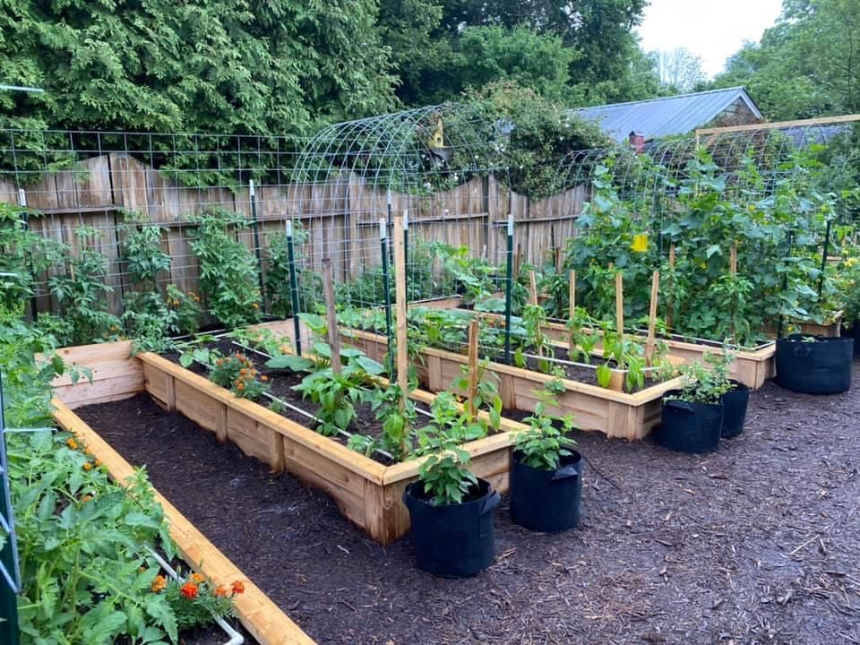

# 🌱 Website Pekarangan Pangan Lestari (P2L) Lalabata Riaja

<div align="center">
  
  
  [](https://pekarangan-pangan-lestari-lalabatariaja.vercel.app/)
  [](https://nextjs.org/)
  [](https://www.typescriptlang.org/)
  [](https://tailwindcss.com/)

  **Platform digital untuk mendukung program Pekarangan Pangan Lestari di Desa Lalabata Riaja, Kabupaten Soppeng**
</div>

---

## 📖 Tentang Proyek

Website P2L Lalabata Riaja adalah platform digital yang dikembangkan untuk mendukung program **Pekarangan Pangan Lestari** di Desa Lalabata Riaja, Kecamatan Lalabata, Kabupaten Soppeng, Sulawesi Selatan. 

Platform ini menyediakan informasi lengkap tentang budidaya tanaman pangan di pekarangan rumah, panduan praktis, serta sistem komunikasi untuk mendukung masyarakat dalam mengembangkan ketahanan pangan keluarga.

### 🎯 Tujuan
- **Edukasi**: Memberikan panduan praktis budidaya tanaman pangan
- **Informasi**: Menyediakan database tanaman yang cocok untuk pekarangan
- **Komunikasi**: Memfasilitasi interaksi antara masyarakat dengan tim P2L
- **Dokumentasi**: Mendokumentasikan kegiatan program P2L

---

## ✨ Fitur Utama

### 🏠 **Beranda**
- Hero section dengan informasi program P2L
- Statistik capaian program
- Galeri kegiatan terbaru
- Call-to-action untuk memulai berkebun

### 🌿 **Database Tanaman**
- **Kategori Lengkap**: Sayuran daun, sayuran buah, rempah-bumbu, TOGA, buah pot, penutup lahan
- **Informasi Detail**: Nama ilmiah, manfaat kesehatan, panduan penanaman
- **Panduan Praktis**: Langkah-langkah penanaman, perawatan, dan panen
- **Visual Menarik**: Gambar berkualitas tinggi untuk setiap tanaman

### 📚 **Panduan Lengkap**
- **Persiapan Media Tanam**: Kompos, media pot, persiapan lahan
- **Teknik Penanaman**: Semai, tanam, perawatan rutin
- **Pemeliharaan**: Penyiraman, pemupukan, pengendalian hama
- **Pasca Panen**: Teknik panen, pengolahan, penyimpanan
- **FAQ**: Jawaban untuk pertanyaan umum
- **Tools & Equipment**: Daftar alat yang diperlukan

### 💬 **Sistem Bantuan & Kontak**
- **Multiple Contact Methods**: Email, WhatsApp, Telepon
- **Form Submission**: Terintegrasi dengan Google Sheets
- **Kategori Bantuan**: 
  - Menambahkan informasi tanaman
  - Saran perbaikan website
  - Laporan masalah teknis
  - Pertanyaan tentang P2L
- **Team Information**: Profil tim dengan foto dan kontak

---

## 🛠️ Tech Stack

### **Frontend**
- **Framework**: Next.js 13+ (App Router)
- **Language**: TypeScript
- **Styling**: Tailwind CSS
- **Icons**: Lucide React
- **Image Optimization**: Next.js Image Component

### **Backend & Integration**
- **API Routes**: Next.js API Routes
- **Database**: Google Sheets (via Google Sheets API)
- **Authentication**: Google Service Account
- **Form Handling**: Custom API with validation

### **Deployment & DevOps**
- **Hosting**: Vercel
- **Domain**: Custom domain from Vercel
- **Environment**: Production-ready configuration
- **CI/CD**: Automatic deployment from Git

---

## 📁 Struktur Proyek

```
P2L-LALABATARIAJA/
├── 📁 public/assets/              # Static assets (images, icons)
│   ├── bawang-merah.jpg
│   ├── bayam.jpg
│   ├── hero-panduan.jpg
│   └── ...
├── 📁 src/
│   ├── 📁 app/                    # Next.js App Router
│   │   ├── 📁 api/                # API Routes
│   │   │   ├── submit-to-sheets/  # Form submission
│   │   │   ├── debug-sheets/      # Debug endpoint
│   │   │   └── test-sheets/       # Connection test
│   │   ├── 📁 bantuan/            # Help & Contact page
│   │   ├── 📁 panduan/            # Guides page
│   │   ├── 📁 tanaman/            # Plants database
│   │   ├── layout.tsx             # Root layout
│   │   └── page.tsx               # Homepage
│   ├── 📁 components/             # Reusable components
│   │   ├── Navbar.tsx
│   │   ├── Footer.tsx
│   │   └── ...
│   ├── 📁 data/                   # Static data
│   │   ├── categories.ts          # Plant categories
│   │   ├── plantsData.ts         # Plants database
│   │   └── panduanData.ts        # Guides data
│   └── 📁 interfaces/             # TypeScript interfaces
│       └── types.ts
├── 📄 .env.local                  # Environment variables
├── 📄 next.config.ts              # Next.js configuration
├── 📄 tailwind.config.ts          # Tailwind configuration
└── 📄 package.json                # Dependencies
```

---

## 🚀 Installation & Setup

### **Prerequisites**
- Node.js 16.8+
- npm atau yarn
- Google Cloud Project dengan Sheets API enabled
- Vercel account (untuk deployment)

### **1. Clone Repository**
```bash
git clone https://github.com/nabilaadama/p2l-lalabatariaja.git
cd P2L-LALABATARIAJA
```

### **2. Install Dependencies**
```bash
npm install
# atau
yarn install
```

### **3. Environment Setup**
Buat file `.env.local`:
```env
# Google Sheets Integration
GOOGLE_SERVICE_ACCOUNT_JSON=<base64_encoded_service_account_json>
GOOGLE_SHEET_ID=<your_google_sheet_id>

# Optional
NODE_ENV=development
```

### **4. Google Cloud Setup**
1. **Create Google Cloud Project**
2. **Enable Google Sheets API**
3. **Create Service Account**
4. **Download Service Account JSON**
5. **Encode JSON to Base64**:
   ```bash
   base64 -i service-account-key.json
   ```
6. **Share Google Sheet** dengan service account email

### **5. Development Server**
```bash
npm run dev
# atau
yarn dev
```

Akses: `http://localhost:3000`

---

## 📊 Google Sheets Integration

### **Sheet Structure**
| Column A | Column B | Column C | Column D | Column E | Column F |
|----------|----------|----------|----------|----------|----------|
| Timestamp | Nama | Email | Topik | Pesan | Status |

### **API Endpoints**
- `POST /api/submit-to-sheets` - Submit form data
- `GET /api/test-sheets` - Test connection
- `GET /api/debug-sheets` - Debug sheet access

### **Features**
- ✅ Form validation (frontend & backend)
- ✅ Error handling dengan user-friendly messages
- ✅ Loading states dan disabled form
- ✅ Base64 encoded service account untuk security
- ✅ Indonesian timestamp (WITA timezone)

---

## 🌱 Database Tanaman

### **Kategori Tanaman**
1. **Sayuran Daun** - Kangkung, bayam, sawi, dll.
2. **Sayuran Buah** - Tomat, cabai, terong, dll.
3. **Rempah & Bumbu** - Jahe, kunyit, serai, dll.
4. **TOGA** - Tanaman obat keluarga
5. **Buah Pot** - Buah-buahan untuk pot
6. **Penutup Lahan** - Tanaman penutup tanah

### **Data Structure**
```typescript
interface Plant {
  id: number;
  name: string;
  scientificName: string;
  image: string;
  description: string;
  benefits: string[];
  planting: {
    season: string;
    duration: string;
    water: string;
    sunlight: string;
    spacing: string;
    steps: string[];
  };
}
```

### **Menambah Tanaman Baru**
1. Update `src/data/plantsData.ts`
2. Tambah gambar ke `public/assets/`
3. Follow struktur data yang konsisten
4. Test di development
5. Deploy ke production

---

## 🎨 Design System

### **Color Palette**
- **Primary Green**: `#16a34a` (green-600)
- **Secondary Green**: `#22c55e` (green-500)
- **Background**: `#f9fafb` (gray-50)
- **Text**: `#111827` (gray-900)
- **Accent**: `#059669` (emerald-600)

### **Typography**
- **Headings**: Font weight 600-800
- **Body**: Font weight 400-500
- **Responsive**: text-sm to text-6xl

### **Components**
- **Cards**: Rounded corners, subtle shadows
- **Buttons**: Consistent hover effects
- **Forms**: Focus states, validation styling
- **Images**: Optimized with Next.js Image

---

## 📱 Responsive Design

### **Breakpoints**
- **Mobile**: `< 640px`
- **Tablet**: `640px - 1024px`
- **Desktop**: `> 1024px`

### **Features**
- ✅ Mobile-first approach
- ✅ Touch-friendly interface
- ✅ Optimized images untuk all devices
- ✅ Responsive navigation
- ✅ Grid layouts yang adaptive

---

## 🚀 Deployment

### **Vercel Deployment**
1. **Connect Repository** ke Vercel
2. **Set Environment Variables**:
   ```
   GOOGLE_SERVICE_ACCOUNT_JSON=<base64_encoded_json>
   GOOGLE_SHEET_ID=<sheet_id>
   ```
3. **Deploy** automatically on push to main
4. **Custom Domain** (optional)

### **Environment Variables di Vercel**
- Go to Vercel Dashboard
- Select Project → Settings → Environment Variables
- Add required variables
- Redeploy

### **Production URL**
🔗 **https://pekarangan-pangan-lestari-lalabatariaja.vercel.app/**

---

## 👥 Tim Pengembang


### **Tim KKN UNHAS Lalabata**
- **Nabila Hamdayani Adama** 

### **Contact Information**
- **WhatsApp**: +62 852-2598-8870
- **Location**: Desa Lalabata Riaja, Kec. Lalabata, Kab. Soppeng

---

## 🤝 Contributing

### **Cara Berkontribusi**
1. **Fork** repository
2. **Create branch** untuk feature baru
3. **Commit** changes dengan message yang jelas
4. **Push** ke branch
5. **Create Pull Request**

### **Guidelines**
- Follow existing code style
- Add comments untuk complex logic
- Test changes sebelum submit
- Update documentation jika perlu

### **Issues & Suggestions**
- Gunakan GitHub Issues untuk bug reports
- Gunakan contact form di website untuk suggestions
- Hubungi langsung ke tim untuk urgent matters

---

## 📄 License

Proyek ini dikembangkan untuk kepentingan publik dan pendidikan dalam rangka program KKN UNHAS di Desa Lalabata Riaja.

**Copyright © 2024 KKN UNHAS Lalabata - Tim P2L**

---

## 🙏 Acknowledgments

- **Universitas Hasanuddin** - Program KKN
- **Pemerintah Desa Lalabata Riaja** - Dukungan dan kerjasama
- **Masyarakat Lalabata Riaja** - Partisipasi dalam program
- **Tim Pembina KKN** - Bimbingan dan arahan
- **Google Cloud Platform** - Layanan Google Sheets API
- **Vercel** - Platform deployment

---

<div align="center">
  <h3>🌱 Mari Bersama Membangun Ketahanan Pangan Keluarga 🌱</h3>
  <p><strong>Website P2L Lalabata Riaja</strong><br>
  Mendukung Pekarangan Pangan Lestari untuk Masa Depan yang Lebih Hijau</p>
  
  <a href="https://pekarangan-pangan-lestari-lalabatariaja.vercel.app/">
    
  </a>
</div>